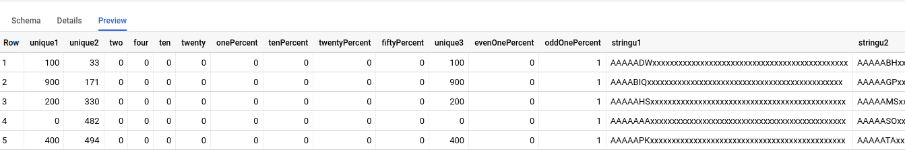

# 587_final_project

### Data Generation 
We generated the mock data using an open source program on github. The url to the program is https://github.com/sqalpel/wisconsin. The program was well documented and and provided clear and simple instructions on how to create the data. All that we had to do to generate the data was specify the number of tuples in each of the tables that we needed and the program created 3 csv files that matched the requirements of the Wisconsin Benchmark data as  specified in the research paper. After the csv files were created, we went through each of them and added the column names. To upload the data into BigQuery on the google cloud platform, we uploaded each of the csv files and selected the auto detect schema and input parameters checkbox. BigQuery correctly detected each of the column datatypes. 
 
### Database System 
The system that we decided to use for this project is BigQuery on the Google Cloud Platform. BigQuery was chosen for a couple of reasons, the main reason being that we don't have to worry about differences in performance due to CPU/RAM. This would be the case if running on our local machines or by using the postgres hosted on the campus (because of shared hardware). Using BigQuery we can have more confidence that the results from testing are accurate and not influenced by other factors. 

### Proof of Implementation
  
  
  
  
 
### Lessons learned 
One lesson that we learned is that BigQuery does not allow you to specify Primary or secondary keys. We discovered this when trying to generate the column names from executing a sql query and trying to specify primary keys. After looking through the BigQuery documentation we confirmed this. Are initial impression of BigQuery is that it appears that there is less customization as compared to other database systems. Some of the advantages to BigQuery was that it was extremely simple to set up and create the datasets and the tables. BigQuery also appears to be well documented which will be helpful as we begin to learn the details of the system.

